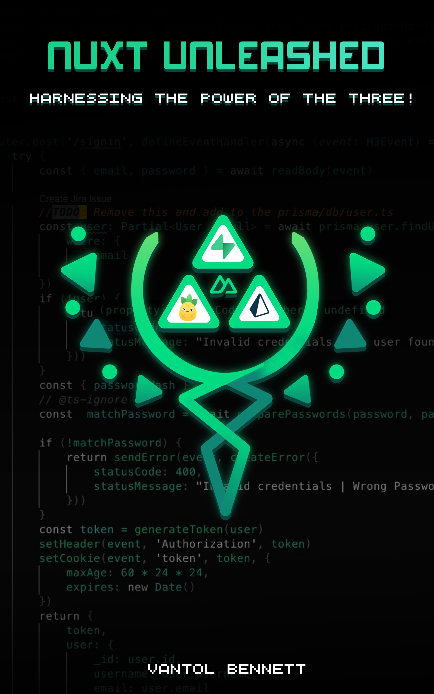

# Nuxt3-Unleashed-Harnessing the Power of the 3

## Introduction

Nuxt is a powerful framework for building web applications, particularly for those who prefer using Vue.js as their frontend library. It is an open-source framework built on top of Vue.js that offers server-side rendering, static site generation, and many other useful features that can simplify web development.
In this book, we will explore the basics of Nuxt 3, including its architecture, features, and benefits. We will also discuss some of the best practices for using Nuxt to build performant and scalable web applications. Whether you are a seasoned Vue.js developer or just starting with web development, this book will give you a good overview of Nuxt and its capabilities.

Check out the book on [Amazon](https://a.co/d/6Gv16uj)